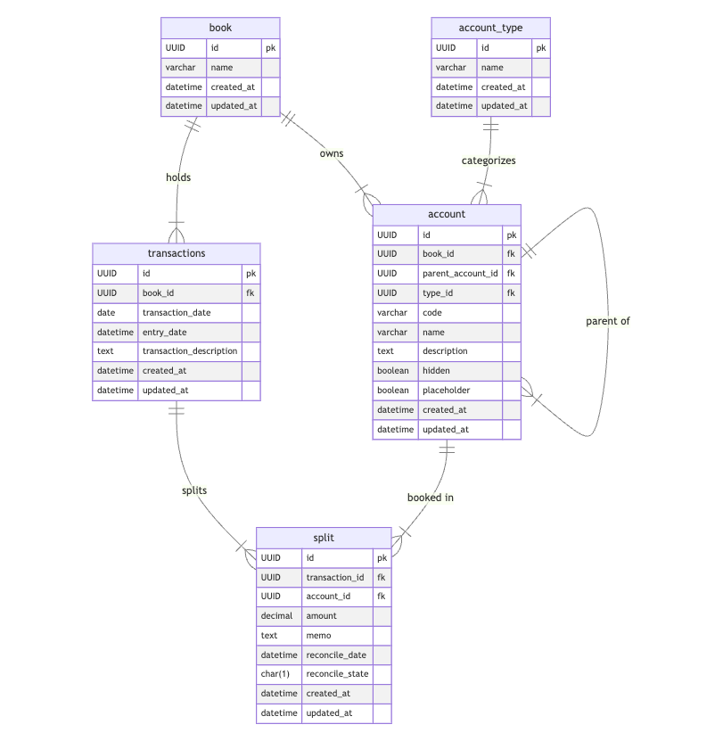

# Accounting System

## 1. Overview and Objectives
The goal of this system is to provide a robust personal finance tracking and reconciliation application. Users can track transactions across multiple accounts, import data from financial institutions, categorize expenses, and perform monthly (or periodic) reconciliations against bank statements. The design draws on double-entry accounting principles—ensuring data consistency, clarity of debits/credits, and the ability to generate meaningful financial reports.

### Key Objectives
1. **Data Integrity**
    - Use **double-entry** style transactions and splits.
    - Enforce referential integrity using foreign keys.
    - Prevent common data errors (e.g., mis-matched books for transaction vs. account).
2. **Easy Reconciliation**
    - Mark transactions as _cleared_ or _reconciled_ within the system.
    - Provide a mechanism (triggers and foreign keys) to avoid mismatched or duplicated data.
3. **Flexibility and Extensibility**
    - The schema uses **UUID** primary keys, making it easier to merge or migrate data.
    - The system can be adapted to different database backends (e.g., migrating from SQLite to PostgreSQL).
4. **Hierarchical Accounts**
    - Support **parent-child** relationships among accounts (e.g., grouping categories under top-level accounts).
    - Allow organizing expense and income categories in a tree-like structure.
5. **Reporting**
    - The schema supports queries and pivoting on **accounts**, **transactions**, and **splits**, essential for generating income/expense statements or custom reports.

## 2. Schema

